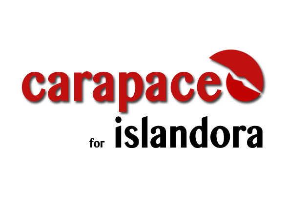

# 

## Introduction

An AdaptiveTheme sub-theme customized to optimize the Islandora experience.

## Requirements

This module requires the following modules/libraries:

* [AdaptiveTheme framework](https://www.drupal.org/project/adaptivetheme) 
* [AdaptiveTheme tools](https://www.drupal.org/project/at_tools) 

## Installation

Installations instructions.

Before installing this theme, please make sure you have downloaded the AdaptiveTheme framework to your /themes folder. AdaptiveTheme is available at https://www.drupal.org/project/adaptivetheme (8.x-3.1 as of latest commit). Be aware that the AdaptiveTheme base does not show up in the appearance tab in the Drupal admin interface.

AdaptiveTheme sub-themes also require an additional module to work correctly. Please download and enable the following project in your /modules folder:

- https://www.drupal.org/project/at_tools (be sure to install the 8.x-3.2 version)

Once you have downloaded and extracted the AdaptiveTheme framework and enabled the associated module, create a /custom folder inside your /themes folder if it doesn't already exist (not necessary but highly recommended). Move to the newly created custom folder and clone this repository inside. Alternatively, you can also download the compressed repository and extract in the custom folder. Once you have the files in the appropriate directory you should see the Carapace for Islandora theme in the appearance tab. Click the 'Install and set as default' link and you should be ready to go.

This theme is a work in progress. If you have questions, suggestions, or comments, consider joining the Islandora User Interface Interest Group located at: https://github.com/islandora-interest-groups/Islandora-UI-Interest-Group.

## Documentation

Further documentation for this module is available on the [Islandora 8 documentation site](https://islandora-claw.github.io/CLAW/).

## Troubleshooting/Issues

Having problems or solved a problem? Check out the Islandora google groups for a solution.

* [Islandora Group](https://groups.google.com/forum/?hl=en&fromgroups#!forum/islandora) * [Islandora Dev Group](https://groups.google.com/forum/?hl=en&fromgroups#!forum/islandora-dev)

## Maintainers/Sponsors

Current maintainers:

* [Debbie Flitner](https://github.com/dflitner)

## Development

If you would like to contribute, please get involved by attending our weekly [Tech Call](https://github.com/Islandora-CLAW/CLAW/wiki). We love to hear from you!

If you would like to contribute code to the project, you need to be covered by an Islandora Foundation [Contributor License Agreement](http://islandora.ca/sites/default/files/islandora_cla.pdf) or [Corporate Contributor License Agreement](http://islandora.ca/sites/default/files/islandora_ccla.pdf). Please see the [Contributors](http://islandora.ca/resources/contributors) pages on Islandora.ca for more information.

We recommend using the [claw-playbook](https://github.com/Islandora-Devops/claw-playbook) to get started. 

## License

[GPLv2](/LICENCSE)

